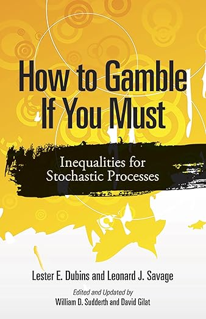

# Getting Started with Portfolio Gambling Theory

## Quick Installation

```bash
# Extract the package
tar -xzf portfolio_gambling_theory.tar.gz
cd portfolio_gambling_theory

# Install dependencies
pip install -r requirements.txt

# Install package in development mode
pip install -e .
```

## 5-Minute Quick Start

### 1. Import the Package

```python
import numpy as np
from portfolio_gambling import (
    MeanVarianceOptimizer,
    KellyOptimizer,
    BoldPlayStrategy,
    MarketSimulator,
)
```

### 2. Generate Sample Data

```python
# Create synthetic market data
sim = MarketSimulator(n_assets=5, n_periods=252, random_seed=42)
returns = sim.generate_returns()
```

### 3. Optimize a Portfolio

```python
# Mean-Variance optimization
mv = MeanVarianceOptimizer(risk_aversion=2.0)
mv_weights = mv.optimize(returns)
print(f"Mean-Variance weights: {mv_weights}")

# Kelly Criterion
kelly = KellyOptimizer()
kelly_weights = kelly.optimize(returns)
print(f"Kelly weights: {kelly_weights}")
```

### 4. Test Gambling Strategies

```python
# Bold play for subfair game
bold = BoldPlayStrategy(target_wealth=2.0, win_prob=0.49)
success_rate, _ = bold.simulate(initial_wealth=1.0, n_simulations=10000)
print(f"Success rate: {success_rate:.2%}")
```

## Interactive Notebooks

The best way to learn is through the Jupyter notebooks:

```bash
cd notebooks
jupyter notebook complete_example.ipynb
```

This notebook covers:
- Data generation
- Single-period optimization
- Multi-period strategies
- Gambling theory
- Complete comparisons

## Package Structure

```
portfolio_gambling_theory/
├── README.md              # Overview
├── docs/
│   ├── theoretical_foundations.md     # Math background
│   ├── implementation_guide.md        # Detailed usage
│   ├── results_summary.md            # Key findings
│   └── getting_started.md            # This file
├── src/portfolio_gambling/
│   ├── __init__.py                    # Main API
│   ├── single_period.py              # MV, EU, VaR, Safety-First
│   ├── multi_period.py               # Kelly, Merton, DP
│   ├── gambling_strategies.py        # Bold/Timid/Proportional
│   ├── market_simulation.py          # Data generation
│   ├── visualization.py              # Plotting
│   └── utils.py                      # Helpers
├── notebooks/
│   └── complete_example.ipynb        # Working example
├── examples/
│   └── quick_start.py                # Simple script
└── requirements.txt                   # Dependencies
```

## Key Concepts

### Portfolio Optimization

**Mean-Variance (Markowitz)**:
- Objective: Maximize return - λ × variance
- Use: Single-period optimization
- Pros: Efficient frontier, closed-form solution
- Cons: Ignores higher moments

**Kelly Criterion**:
- Objective: Maximize E[log(wealth)]
- Use: Long-term growth optimization
- Pros: Asymptotically optimal
- Cons: Can be very aggressive

**Expected Utility**:
- Objective: Maximize E[U(wealth)]
- Use: General preferences
- Pros: Theoretically correct
- Cons: Need to specify utility function

### Gambling Strategies

**Bold Play** (Dubins-Savage):
- Game: Subfair (p < 0.5)
- Strategy: Bet everything you can
- Goal: Maximize P(reach target before ruin)
- Result: Optimal for desperate situations

**Kelly Betting**:
- Game: Favorable (p > 0.5)
- Strategy: Bet fixed fraction of wealth
- Goal: Maximize long-run growth
- Result: Optimal bet size = (p - q) / odds

## Common Use Cases

### 1. Asset Allocation

```python
# Generate returns for stocks, bonds, etc.
sim = MarketSimulator(
    n_assets=3,
    mean_returns=np.array([0.10, 0.06, 0.03]),  # Stocks, bonds, cash
    volatilities=np.array([0.20, 0.08, 0.01]),
)
returns = sim.generate_returns()

# Find optimal allocation
optimizer = MeanVarianceOptimizer(risk_aversion=2.0)
weights = optimizer.optimize(returns)
print(f"Allocation: {weights}")
```

### 2. Kelly Betting

```python
# For a favorable binary bet
win_prob = 0.55
odds = 1.0  # Even money

from portfolio_gambling import ProportionalBetting
kelly_fraction = ProportionalBetting.kelly_fraction(win_prob, odds)
print(f"Kelly fraction: {kelly_fraction:.2%}")  # Should be 10%
```

### 3. Risk Analysis

```python
from portfolio_gambling import VaROptimizer
from portfolio_gambling.utils import calculate_portfolio_metrics

# Minimize tail risk
var_optimizer = VaROptimizer(alpha=0.05, use_cvar=True)
var_weights = var_optimizer.optimize(returns)

# Calculate metrics
metrics = calculate_portfolio_metrics(returns, var_weights)
print(f"CVaR (95%): {metrics['cvar_95']:.2%}")
print(f"Max Drawdown: {metrics['max_drawdown']:.2%}")
```

### 4. Strategy Comparison

```python
from portfolio_gambling.visualization import plot_strategy_comparison

# Compare multiple strategies
strategies = {
    'Equal Weight': np.ones(n_assets) / n_assets,
    'Mean-Variance': mv_weights,
    'Kelly': kelly_weights,
}

# Calculate metrics for each
results = {}
for name, weights in strategies.items():
    results[name] = calculate_portfolio_metrics(returns, weights)

# Plot
fig = plot_strategy_comparison(
    results,
    metrics=['sharpe_ratio', 'max_drawdown', 'var_95'],
    title='Strategy Comparison'
)
```

## Troubleshooting

### Installation Issues

**Problem**: `cvxpy` installation fails
```bash
# Solution: Install with conda
conda install -c conda-forge cvxpy
```

**Problem**: Jupyter not starting
```bash
# Solution: Install notebook separately
pip install notebook
jupyter notebook
```

### Runtime Issues

**Problem**: Optimization doesn't converge
```python
# Solution: Check your data
print(f"Mean returns: {np.mean(returns, axis=0)}")
print(f"Covariance condition number: {np.linalg.cond(np.cov(returns.T))}")

# Try different solver
optimizer = MeanVarianceOptimizer(risk_aversion=2.0)
# In the code, cvxpy will try different solvers automatically
```

**Problem**: Kelly gives negative weights
```python
# Solution: Use fractional Kelly or add constraints
kelly = KellyOptimizer(fraction=0.5, allow_short=False)
weights = kelly.optimize(returns)
```

## Learning Path

### Beginner (1-2 hours)
1. Read `README.md`
2. Run `examples/quick_start.py`
3. Work through `notebooks/complete_example.ipynb`
4. Experiment with different parameters

### Intermediate (3-5 hours)
1. Read `docs/theoretical_foundations.md`
2. Study `docs/implementation_guide.md`
3. Run all notebooks
4. Modify code for your own data
5. Compare strategies on different scenarios

### Advanced (1-2 days)
1. Read original papers (see references)
2. Implement custom utility functions
3. Add new optimization criteria
4. Test on real market data
5. Contribute back to package

## Next Steps

### Extend the Package

Add your own strategies:

```python
# Example: Custom optimizer
from portfolio_gambling.single_period import MeanVarianceOptimizer

class MyOptimizer(MeanVarianceOptimizer):
    def optimize(self, returns):
        # Your custom logic
        weights = super().optimize(returns)
        # Post-process weights
        return weights
```

### Use Real Data

```python
import yfinance as yf

# Download data
tickers = ['AAPL', 'GOOGL', 'MSFT', 'AMZN', 'TSLA']
data = yf.download(tickers, start='2020-01-01', end='2024-01-01')
returns = data['Adj Close'].pct_change().dropna()

# Optimize
optimizer = KellyOptimizer()
weights = optimizer.optimize(returns.values)

print(dict(zip(tickers, weights)))
```

### Share Results

Found interesting results? Consider:
- Publishing your analysis
- Contributing improvements
- Sharing insights with community

## Resources

### Documentation
- `/docs/theoretical_foundations.md`: Mathematical background
- `/docs/implementation_guide.md`: Detailed usage examples
- `/docs/results_summary.md`: Key empirical findings

### Code Examples
- `/notebooks/`: Interactive Jupyter notebooks
- `/examples/`: Simple Python scripts
- `/tests/`: Unit tests showing usage

### References
- Markowitz (1952): Portfolio Selection
- Kelly (1956): Information Rate
- Dubins & Savage (1965): How to Gamble If You Must
- Merton (1969): Lifetime Portfolio Selection
- Thorp (2006): Kelly Criterion Applications
---


---

## Get Help

### Common Questions

**Q: Which optimizer should I use?**
A: Depends on your goals:
- Long-term growth → Kelly
- Single period, normal returns → Mean-Variance
- Tail risk focus → CVaR
- Specific target → Bold Play (only if desperate!)

**Q: Why is Kelly so aggressive?**
A: Kelly maximizes geometric mean, not arithmetic mean. It assumes:
- Infinite horizon
- Continuous rebalancing
- No consumption needs
- Try fractional Kelly (0.5x) for more conservative approach

**Q: When should I use Bold Play?**
A: Only in subfair games where you must reach a target:
- Game odds against you (p < 0.5)
- Specific wealth target
- Finite time horizon
- Example: Must double money to pay debt

**Q: How often should I rebalance?**
A: Depends on transaction costs:
- Kelly assumes continuous rebalancing
- Practically: monthly or quarterly
- Use tolerance bands (e.g., ±5% from target)
- See `notebooks/05_transaction_costs.ipynb`

### Support

For questions or issues:
1. Check documentation in `/docs/`
2. Review example notebooks
3. Read implementation guide
4. Check GitHub issues (if applicable)

## Summary

This package provides:
✓ Comprehensive portfolio optimization implementations
✓ Gambling strategy simulations
✓ Interactive Jupyter notebooks
✓ Extensive documentation
✓ Working code examples

Start with the complete example notebook and explore from there!

Happy optimizing! 📈
